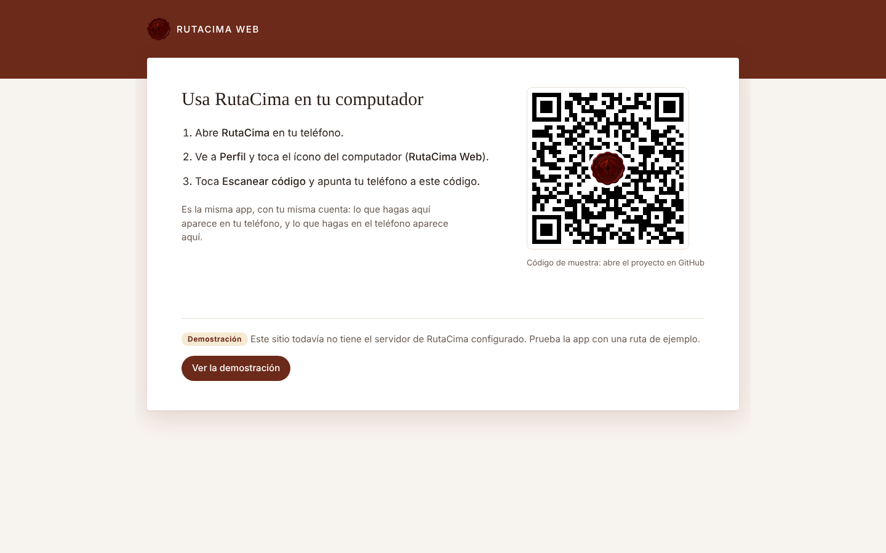
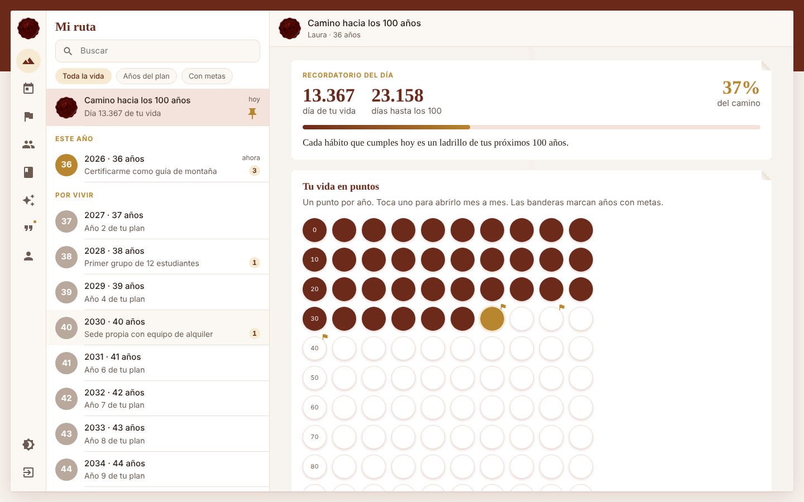
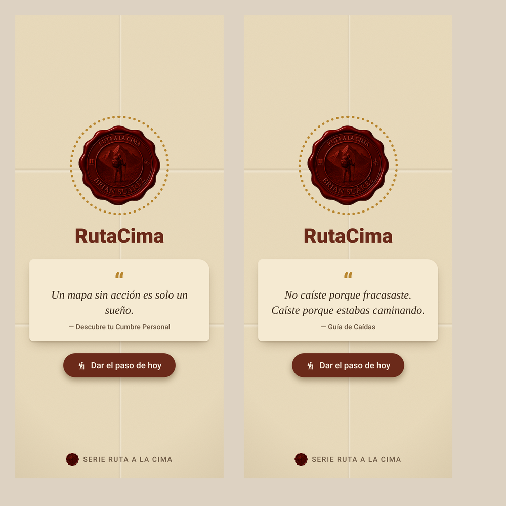
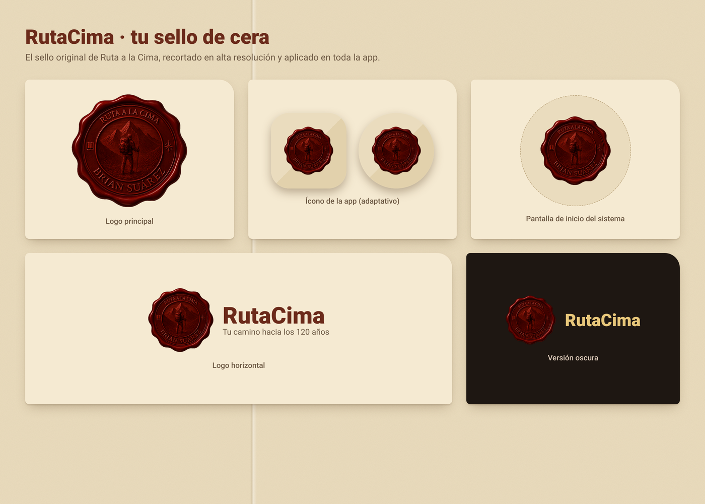

<p align="center">
  
</p>

<h1 align="center">Rutaalacima</h1>

<p align="center">
  <b>Tu vida hasta los 120 años, vista año por año y día por día.</b><br>
  La app del método <b>Ruta a la Cima</b>: 7 fases × 6 ejes para llegar a tu Cumbre Personal.
</p>

<p align="center">
  
  
  
  
  
</p>

<p align="center">
  <a href="https://passbri.github.io/rutacima/"><b>🌐 Abrir Rutaalacima Web</b></a>
  &nbsp;·&nbsp; la misma app en tu computador<br>
  <a href="https://github.com/PassBri/rutacima/releases/tag/apk-reciente"><b>📱 Descargar el APK más reciente</b></a>
</p>

<p align="center">
  <a href="https://passbri.github.io/rutacima/video.html">
    
  </a><br>
  <a href="https://passbri.github.io/rutacima/video.html"><b>▶ Ver el video de presentación</b></a> (55 s, con sonido)
  &nbsp;·&nbsp; <a href="diseno/video/rutaalacima_presentacion.mp4">descargar MP4</a>
</p>

> Serie Ruta a la Cima · © 2026 Brian Gonzalo Suárez Acevedo. Todos los derechos reservados.

---

## Contenido

1. [Qué es Rutaalacima](#qué-es-rutaalacima)
2. [El método en la app](#el-método-en-la-app)
3. [Recorrido por la app](#recorrido-por-la-app)
4. [Rutaalacima Web](#rutaalacima-web)
5. [Privacidad y seguridad](#privacidad-y-seguridad)
6. [Diseño](#diseño)
7. [Instalar y ejecutar](#instalar-y-ejecutar)
8. [Servidor, coach IA y web](#servidor-coach-ia-y-web)
9. [Cómo está hecha](#cómo-está-hecha)
10. [Contenido, pruebas y próximos pasos](#contenido-pruebas-y-próximos-pasos)

---

## Qué es Rutaalacima

Rutaalacima convierte el método **Ruta a la Cima** en una app para el día a día. Muestra tu vida como un camino
de puntos, **un punto por año hasta los 100 o 120**, y la baja en cascada a meses, semanas y días. Así ves
cómo lo que haces hoy suma a tu propósito a los años que tú elijas.

Incluye:

- un **planificador en cascada** con avance automático: propósito → año → mes → día;
- **18 hábitos diarios**, tres por cada eje;
- **24 guías** del método para completar en el teléfono, con resultados;
- un **coach con inteligencia artificial** que conoce tus metas y tu avance;
- **365 frases** de los libros, una por día, **selladas con cera** y que abres con tu rostro, tu huella o tu clave;
- una **comunidad** para compartir logros, evidencias y tu vision board;
- **Rutaalacima Web**, la misma app en el computador, con tu misma cuenta.

<p align="center">
  <br>
  <sub>Vistas previas del diseño (papel antiguo y papel blanco, frase sellada y un mes).</sub>
</p>

## El método en la app

**Tu Cumbre Personal** no es un punto geográfico ni una simple meta: es el estado en que todas tus dimensiones
convergen. Para llegar se atraviesan **7 fases** y se activan **6 ejes**.

| Las 7 fases del viaje | Los 6 ejes de tu cumbre |
|---|---|
| 1. Orientación | **Voluntad** · la llama que enciende tu camino |
| 2. Preparación | **Maestría** · la fortaleza que construyes con el tiempo |
| 3. Travesía | **Voz** · tu expresión auténtica en el mundo |
| 4. Ascenso | **Valor** · la capacidad de sostener tu vida con coherencia |
| 5. Culminación | **Evolución** · tu crecimiento constante |
| 6. Contemplación | **Trascendencia** · tu conexión con tu legado |
| 7. Descenso | |

**La cascada.** Cada propósito a largo plazo tiene metas anuales (los "campamentos base"), cada meta anual tiene
metas del mes, y cada meta del mes se marca día a día. El avance **sube solo**: los días cumplidos llenan la meta
del mes, las metas del mes llenan la del año, y las del año llenan el propósito. Si un nivel todavía no tiene
metas debajo, usas un avance manual.

## Recorrido por la app

### Primer uso: bienvenida y compromiso

La primera vez, la app te recibe como senderista y te pide:

- tu nombre;
- tu Cumbre Personal en una frase (puedes escribirla después);
- la fase en la que estás hoy.

Cierra con un **compromiso** de seis puntos: ser honesto contigo mismo, actuar con constancia, levantarte cada vez
que caigas, celebrar cada avance, revisar tu ruta cada 30 días y no rendirte cuando el camino se ponga difícil.

### Ventana de inicio y frase sellada

Cada vez que abres la app aparece el sello de cera con la **frase del día**: una de las **365 frases** tomadas
textualmente de los libros, una para cada día del año.

- Para leerla **rompes el sello**, según lo que elijas en Ajustes:
  - con tu **rostro o huella**: lo verifica el teléfono y la app nunca ve tu cara;
  - con una **clave numérica**;
  - con un **toque**.
- Tras 5 intentos fallidos de clave hay que esperar 30 segundos.
- Al abrirla, la frase te invita a **dar el paso de hoy**.
- Las frases que abriste se guardan en **Mis frases**. Las de días anteriores que no abriste quedan selladas.

<p align="center">
  
</p>

### Navegación

- **Barra inferior:** cinco secciones, **Mi ruta, Hoy, Comunidad, Aprende y Perfil**, y en el centro el botón para
  **publicar**: una montaña con una bandera en la cima y un «+», porque compartir un logro es plantar tu bandera. Para ocupar poco espacio
  muestra solo íconos; al apoyar el dedo aparece el nombre, y si lo deslizas por la barra el nombre lo sigue.
  Al soltar se abre esa sección.
- **Barra superior:** el sello y el nombre de la pantalla donde estás.
- **Coach:** se abre desde el botón con destellos de la barra superior.

### Mi ruta

El centro de la app: **"Camino hacia los 100 años"**. La meta de vida la eliges entre 60 y 120 años.

- **Tu vida en puntos:**
  - un punto por año, diez por fila, con el año escrito dentro de cada punto;
  - en burdeos lo vivido, en dorado el año actual y en blanco lo que falta;
  - una **bandera** marca los años con metas.
- **Cascada año → mes → semana → día:** tocas un año y bajas a sus meses; de ahí a las semanas y a cada día.
  Una miga de pan arriba te deja volver a cualquier nivel.
- **Botón flotante de saltos:** te lleva a hoy, esta semana, este mes o este año.
- **Recordatorio del día:**
  - qué día de tu vida es hoy;
  - cuántos días quedan hasta tu meta;
  - una frase distinta cada día.

  También puede llegar como **notificación diaria** a la hora que elijas.
- **Planificador** (se abre desde cada nivel), con seis pestañas:
  - **Cascada:** todo el árbol de metas con su avance;
  - **Día:** planificador diario con intención, prioridad #1, horario, pendientes, victorias, aprendizaje,
    gratitud, energía, agua y finanzas del día;
  - **Mes:** calendario del mes y balance mensual;
  - **Año:** metas anuales;
  - **Largo plazo:** propósitos al número de años que elijas (de 2 a 50) con su plan de acción;
  - **Balance:** balance anual.

### Hoy

Tu tablero del día:

- **Tu paso de hoy** (la primera semana): nueve pasos cortos, uno por día, que llevan de definir la cumbre a la
  primera revisión. Si te saltas un día, el paso te espera; no se acumulan.
- **Bienvenida sin culpa:** si vuelves después de varios días, la app no te reprocha nada; te propone un regreso de
  5 días, empezando por lo mínimo.
- **Revisión semanal y mensual:** tres preguntas (qué funcionó, qué no, qué cambio) cuando toca. Quedan guardadas y
  el coach las tiene en cuenta.
- **Constancia:** racha de días, mejor racha y el **mapa del año**, un cuadro por día con su intensidad.
- **Comodines de racha** (como en Duolingo): ganas uno por cada 7 días seguidos con hábitos, hasta 2. Si un día no
  marcas nada, un comodín lo cubre y la racha sigue; ese día se ve en azul hielo en el mapa.
- **La frase del día te pregunta algo:** cada día una pregunta distinta sobre la frase (qué hiciste que se le
  parezca, a quién se la dedicarías, una foto de tu día…). *Responder y compartir* abre una reflexión ya vinculada a
  la frase, sin prisa ni cuenta regresiva.
- **Tu año en la ruta** (como el resumen anual de Strava): del 1 de diciembre al 15 de enero aparece en Hoy, y
  siempre desde Constancia. Son historias a pantalla completa con tus días con hábitos, el mapa del año, tu mejor
  racha, tu eje más fuerte, tu mejor mes, las metas cumplidas, los recuerdos y las frases abiertas; al final lo
  compartes o lo publicas en la comunidad.

- **Tu cumbre en una frase**, siempre a la vista.
- **Anillos de avance** de la cascada: propósito, año, mes y hoy.
- **Prioridad #1** del día.
- **Metas del mes**, para marcar con un toque que hoy diste el paso.
- **Checklist de 18 hábitos**, tres por eje. Por ejemplo: *"Hice algo hoy que me acerca a mi cumbre"*,
  *"Practiqué una habilidad clave"* o *"Ayudé a alguien sin esperar nada a cambio"*. Con 10 a 12 marcados vas
  en buen camino.
- **¿Día difícil?** Botones de rescate: *Me perdí*, *Tuve un mal día* y el *Kit de emergencia*.
- Accesos al **coach** y a **compartir tu avance** en la comunidad.

### Metas

**Nueva meta** abre un asistente de 4 pasos: **Nivel, Inspiración, Detalles y Plan**.

- **Nivel:** propósito a largo plazo, meta del año o meta del mes.
- **Inspiración:** se apoya en los bancos del método:
  - más de 80 metas para adaptar;
  - 150 indicadores por eje;
  - más de 200 acciones que activan varios ejes;
  - proyectos de confluencia.
- **Detalles y Plan:** cómo sabrás que la lograste y los pasos para llevarla a cabo.
- **Mejorar con IA** reescribe la meta en formato **ORSE**: Observable, Relevante, Específica y con Evidencia.

Cada meta anual lleva además:

- **prioridad ABCD:** máxima, importante, reactiva u observación;
- una **decisión:** continuar, acelerar, pausar o eliminar;
- un **estado:** no iniciada, iniciada, en pausa, en curso, avanzada o cumplida.

### Comunidad

Una bitácora para compartir el ascenso, con un formato propio (no es una copia de Instagram):

- **Cómo se ve cada publicación:** una postal horizontal 4:3 con la meta y el eje. Si no hay foto, se muestra la
  frase como cita destacada.
- **Cinco tipos:** logro, evidencia, visión (vision board), meta y reflexión.
- **Quién la ve:** pública, solo seguidores o solo yo.
- **Interacción:** **impulsos** (el voto de Rutaalacima), comentarios y seguir a otras personas.
- **Explorar por eje:** debajo de los filtros, una fila con los 6 ejes para ver solo las publicaciones de Voluntad,
  Maestría, Voz, Valor, Evolución o Trascendencia.
- **Guardados:** el marcador de cada publicación la guarda en el filtro *Guardados*, para volver a lo que te inspira.
- **Compartir un logro al cumplirlo:** cuando la bandera se clava en la cumbre, el botón *Compartir este logro* abre la
  publicación ya escrita y con la meta vinculada.
- **Comunidad segura:** cada publicación se puede **reportar** (con motivo) y cada persona se puede **bloquear**.
  Con 3 reportes de personas distintas, la publicación se oculta hasta que el equipo la revise. Hay límites contra
  el spam (mensajes por minuto, publicaciones y solicitudes por día).
- **Cordadas:** grupos de 3 a 6 personas con un reto en común (por ejemplo, 30 días de un eje). Se crean con un
  código de invitación; cada uno marca su día y todos ven el avance del grupo, con notas para animarse.
- **Filtros del inicio:** *Para ti*, *Vision boards* y *Siguiendo*.
- **La expedición de la comunidad (en milímetros):** toda la comunidad sube una sola montaña de 8.848.000 mm por
  año. Es una idea propia inspirada en el ajuste de dificultad de Bitcoin, sin cadena de bloques: cada semana es un
  tramo y, al empezar, la dificultad se recalcula con los aportes del tramo anterior para que a ese ritmo la cumbre
  llegue al final del año. Si llegan millones de personas, cada publicación vale fracciones de milímetro. Como en
  Bitcoin, la dificultad no cambia más de 4 veces de un tramo al siguiente, y ningún tramo sube más de 4/52 de la
  montaña (la cumbre nunca llega antes de 13 semanas). Publicación = 10 puntos, impulso = 1 punto; lo privado no
  cuenta. El servidor solo devuelve totales por semana (`expedicion()` en `supabase/schema.sql`) y la cuenta vive en
  `domain/model/Expedicion.kt` y en la web. La bandera avanza con un resorte y el sendero recorrido ondea. Al
  impulsar, el botón se transforma de círculo en sol; los avatares van en forma de galleta. Son las formas y el
  movimiento de Material 3 Expressive, hechos con `androidx.graphics:graphics-shapes`.
- **Un solo muro con vista inmersiva:** la Comunidad es un muro que se recorre hacia abajo. Al tocar una
  publicación se abre **Cimas**, a pantalla completa desde esa misma publicación, para pasar a la siguiente
  deslizando hacia arriba (doble toque para impulsar). Al volver, el muro queda donde ibas. Igual en la web.
- **Sin cuenta**, la comunidad se muestra en modo demostración con publicaciones de ejemplo.

### Aprende: las 24 guías

Una biblioteca organizada por las etapas del ascenso. Cada guía se completa en la app y tus respuestas quedan
guardadas. Las evaluaciones **generan resultados**:

- total y porcentaje;
- interpretación;
- barras por grupo;
- foco sugerido;
- radar de ejes, que puedes guardar en **Mis ejes**.

| Etapa | Guías |
|---|---|
| **La ruta** | Descubre tu Cumbre Personal · Los 6 Ejes de tu Cumbre · El Viaje Transformativo · Diagnóstico Personal · Confluencia · Portales y Transiciones · Del Propósito al Valor · Campamento Base · Desde la Cima · Compañero de Ascenso · Guía de Caídas |
| **Herramientas** | Kit de Emergencia · Cuando te pierdes en la niebla · Cierre del Planificador 5 años |
| **Bonos** | Banco de Indicadores · Banco de Metas · Plantillas de Confluencia · Checklist de Cierre Mensual · Banco de Acciones Multi-Eje · Sistema Anti-Abandono · Kit de Evidencias |
| **Lecturas** | Ruta a la Cima (ebook) · Teoría del Viaje Transformativo |
| **Facilitadores** | Manual para Facilitadores |

#### Audiolibros 🎧

Todas las guías se pueden **escuchar** (unas 13 horas en total): botón **Escuchar** en la portada de cada guía o
**Escuchar este capítulo** abajo en cada capítulo.

- **Seguir escuchando:** la app recuerda dónde quedaste en cada guía.
- **Sin conexión:** las grabaciones del autor se pueden **descargar** para escucharlas sin internet.
- **Temporizador de sueño:** 15, 30 o 60 minutos, o al terminar el capítulo.

- **Dos voces.** Si el autor subió su grabación de un capítulo, suena esa grabación (🎙 *Grabación del autor*).
  Si no, la app lee el capítulo con la voz del teléfono, en español.
- **Como un audiolibro de verdad:** pausa, retrocede o avanza (una frase con la voz del teléfono, 15 segundos en
  una grabación), velocidad de 0,75× a 2×, y al terminar un capítulo sigue con el siguiente. La página avanza con el audio.
- **Sigue sonando** al cambiar de pantalla (mini reproductor sobre la barra), con la pantalla apagada (notificación
  para pausar, pasar de capítulo o cerrar) y se pausa si desconectas los audífonos.
- **Subir tus grabaciones.** Si tu cuenta es de autor, en cada capítulo aparece el botón para **subir**, **reemplazar**
  o **quitar** tu grabación (mp3, m4a, ogg o wav de hasta 50 MB), desde la app o desde la web. En cuanto la subes,
  todos la escuchan en ese capítulo.
- **Grabaciones dentro de la app (sin servidor).** También puedes incluirlas en el proyecto:
  `app/src/main/assets/audios/{guía}/{capítulo}.mp3`, por ejemplo `assets/audios/companero/0.mp3` para el primer
  capítulo de *Compañero de Ascenso* (los capítulos se cuentan desde 0). La web las publica también.

### Coach IA

Un coach que responde con tu realidad, porque conoce:

- tu nombre y tu cumbre;
- tu fase;
- tus ejes;
- tus propósitos, metas del año y del mes, con su avance.

Sugerencias rápidas: *ayúdame a definir mi cumbre*, *divide mi meta anual en pasos*, *perdí la motivación*,
*planea mi semana*, *¿qué eje debo trabajar?* y *quiero crear un hábito*.

- **Con servidor**, usa inteligencia artificial con un límite diario por cuenta.
- **Sin conexión**, funciona en **modo guía**: responde con los protocolos y los bancos del método.
- **Crea metas por ti:** cuando la conversación llega a una meta concreta, el coach la propone con un botón
  **Crear esta meta** y queda en tu cascada. Conoce además tu racha y tu última revisión.

### Mensajes y coach de vida

**Mensajes 1 a 1** (ícono de mensajes arriba en Comunidad, o el botón **Mensaje** en cualquier publicación):

- Si dos personas se siguen mutuamente, conversan directo.
- Si no, el primer mensaje llega como **solicitud**: la otra persona lo lee y decide si acepta. Mientras no acepte,
  no se puede enviar un segundo mensaje.
- Cualquier conversación se puede **bloquear** o **reportar**.

**Coach de vida** (ícono del senderista arriba en Perfil, o desde el coach IA): una persona real que te acompaña.

- **Directorio de coaches verificados.** Solo aparecen los que el equipo de Rutaalacima revisó.
- **Pides que sea tu coach** y él o ella acepta. Desde ese momento chatean sin solicitudes.
- **Compartir mi avance** es un interruptor tuyo: tu coach ve tu cumbre, propósitos, metas con su avance, hábitos de
  los últimos 7 días, ejes y vision board. Nunca tus respuestas de los libros ni tus notas. Lo apagas y deja de verlo.
- **Ser coach.** Cualquiera puede postularse con su especialidad y cómo acompaña; queda en revisión hasta que se verifica.
  Si eres coach, ves a las personas que acompañas y su avance (solo si lo comparten).
- **Sesiones:** se agendan desde la conversación, con día, hora, duración, tema y enlace de videollamada.
- **Notas privadas del coach** sobre cada persona que acompaña; esa persona no las ve.

**Avisos:** la app te avisa de mensajes nuevos, solicitudes y pedidos de coaching (se revisa cada 15 minutos; se
apaga en Ajustes). Tocar el aviso abre la conversación.

### Kit de emergencia

Herramientas que funcionan cuando las usas, no cuando las guardas:

- **Revisión mensual:** 15 minutos.
- **Plan semanal simplificado:** 10 minutos.
- **Preguntas de reorientación:** 3 minutos.
- **Checklist de cierre mensual.**
- **Tracker de 7 días.**
- **Matriz de decisiones**, que compara opciones con puntos.
- **Tarjetas de recordatorio**, una por eje. Por ejemplo: *"¿Esto me acerca o me aleja de mi cumbre?"*
- Los **8 protocolos** de *Cuando te pierdes en la niebla*.

### Perfil

- **Publicaciones:** tu diario de vida en fichas 4:5, a dos columnas.
- **Mi vida:** cada año, mes a mes, con lo que registraste. Puedes registrar un recuerdo o soñar un año futuro.
- **Vision board armado con IA:** con tu cumbre, tus propósitos, tus metas y tus ejes más débiles, la IA propone
  hasta 9 casillas. Cada una trae una frase en primera persona y qué foto tuya buscar o tomar. Tú las llenas con
  tus propias fotos (o buscas ideas en un banco de imágenes libres). Sin conexión, la app arma el tablero con las
  mismas reglas del método. Las fotos se guardan como publicaciones de visión privadas.
- **Brújula de la Cima 9×9 (modelo propio, a partir del Mandala Chart).** El Mandala Chart (Mandal-Art, de Hiroaki
  Matsumura; el método Harada con el que Shohei Ohtani planeó su carrera) es una cuadrícula fija de 8 áreas y 64
  tareas sin orden. La Brújula lo rehace con los libros de Ruta a la Cima:
  - **El centro es el vision board:** la cumbre en medio y 8 campamentos fijos como una rosa de los vientos: los
    6 ejes (Trascendencia al norte, Voluntad al sur como base), **Confluencia** (un proyecto que activa varios ejes,
    Bono 3) y **Campamento Base** (mentor, cordada y red de apoyo). Cada casilla se edita y lleva su foto de visión.
    Al armar el tablero, cada eje toma tu propósito o tu meta del año de ese eje, y las casillas se actualizan en su
    lugar sin perder sus pasos.
  - **Zoom de 3 niveles en papel (Material, container transform):** la Brújula vive en una hoja de papel con su
    pliegue y se abre en **1** (tu cumbre, con su foto enmarcada como una impresión), **9** (el vision board en fichas
    de papel con la cinta del color de su eje, el rumbo y 8 puntos de avance) y **81** (el 9×9 completo). Lo que tocas
    se vuelve el centro del nivel siguiente, con un resorte. **Volver es fácil** desde cualquier nivel: el botón o
    gesto atrás del teléfono, la flecha *Alejar*, las migas *Cumbre › Vision board › 9×9* (se pueden tocar) y, en
    la web, la tecla Esc.
  - **Cada bloque es un viaje:** sus 8 pasos van en sentido del reloj por las 7 fases del Viaje Transformativo
    (Orientación, Preparación, Travesía, Ascenso, Cima, Contemplación, Descenso) y terminan en el Legado (Desde la
    Cima). Al armar el tablero los pasos se llenan solos con las acciones de tus propósitos y el banco de acciones.
  - **De la visión a la evidencia:** un paso ganado recibe su foto real (Kit de Evidencias), que reemplaza a la
    visión en el borde del 9×9, se guarda como evidencia privada y aparece en el diario de vida. Con el año, el
    9×9 pasa de soñado a vivido.
  - **Portales:** al ganar un paso se registra qué sueltas y qué llevas (Portales y Transiciones).
  - **Compartir:** una imagen vertical de 1080 × 1350 con la cumbre, las fotos, los pasos, las evidencias y tu
    altura en milímetros, para tus seguidores o para todos.
  - **Explorable en la comunidad:** al compartir, la publicación lleva una instantánea de tu Brújula (columna
    `brujula` en Supabase) y eliges si van tus 64 pasos y tus fotos de evidencia. En el muro aparece tu cumbre en papel
    con las cintas de avance de cada campamento; al tocarla, cualquiera la explora con el mismo zoom 1 · 9 · 81 en
    solo lectura. Cada publicación es una foto del momento: compartir de nuevo meses después muestra el avance. La
    imagen 1080 × 1350 sigue saliendo para descargarla.
  - **Niebla y caídas:** un paso empezado que lleva 14 días sin jornadas se cubre de niebla y ofrece los protocolos
    de *Cuando te pierdes en la niebla*. Si reconoces que te caíste, eliges el tipo de caída (financiera, emocional,
    de decisión, de carácter, de identidad o circunstancial, de la Guía de Caídas): el paso conserva sus jornadas y
    pide como máximo la dificultad actual para que vuelvas (Sistema Anti-Abandono).
  - **Pasos de confluencia:** un paso puede activar otros campamentos (Bono 5, acciones multi-eje). Al sugerir pasos,
    las acciones que activan 3 ejes o más quedan enlazadas (hasta 2 por campamento); al ganarlas, una línea une el
    paso con esos campamentos en el 9×9.
  - **Cierre del año (Desde la Cima):** escribes las 7 lecciones de tu año, la Brújula del año se guarda en tu
    diario de vida como reflexión privada con sus lecciones, y empiezas una nueva montaña: los pasos ganados se
    liberan (siguen en el diario con sus evidencias) y se llenan con pasos nuevos; los que van a medio camino
    conservan sus jornadas. Las reglas están en `domain/model/Travesia.kt` (con pruebas) y en la web.
- **Método Cima 9×52 (modelo propio):** la mandala se sube durante el año con las mismas reglas de la expedición.
  Tu montaña personal mide 8.848.000 mm y cada uno de los 64 pasos vale 138.250 mm. Un paso no se marca: se gana
  con **jornadas**, días distintos en que avanzaste en él (una prueba de constancia en lugar de la prueba de trabajo
  de Bitcoin). Cada 4 tramos —un ciclo, como los 2.016 bloques de Bitcoin— la dificultad (jornadas que pide un paso
  nuevo) se recalcula comparando los pasos ganados en el ciclo con el ritmo que lleva a la cumbre el 31 de diciembre:
  si vas muy rápido sube, si te frenas baja para que vuelvas. Nunca cambia más de 4 veces de un ciclo al siguiente
  (entre 1 y 30 jornadas) y queda fija para cada paso desde su primera jornada. La tarjeta del método muestra tu
  altura en milímetros, la dificultad actual, los pasos esperados esta semana, los días para el próximo ajuste y si
  vas adelante o atrás del ritmo. Las reglas están en `domain/model/MetodoCima.kt` (con pruebas) y en la web.
- **Carta de bienvenida:** la primera vez, la app (y la página de inicio de la web) muestra una carta antigua en
  pergamino, doblada y cerrada con el sello de cera de Rutaalacima. Al romper el sello —con el mismo quiebre de la
  frase del día— la carta se despliega con un mensaje del fundador. Se relee desde el perfil (y en la web, desde la
  pantalla de vincular).
- **Ejes:** evaluación del 1 al 10, radar comparado e historial.
- **Mis frases:** las frases que ya abriste este año.
- **Diario de vida:** un álbum por cada año de tu vida, con las fotos en mosaico, los recuerdos y las metas cumplidas.
  Puedes registrar recuerdos en cualquier año y mes (también de antes de usar la app). Cada año tiene su
  visibilidad: **solo yo**, **seguidores** o **público**; al compartir un año puedes incluir lo que tenías como
  "Solo yo". En la comunidad, tocar el nombre de alguien abre su diario, con solo los años que esa persona comparte.
- Los accesos están agrupados en **Mi ascenso**, **Personas** y **Más**.

### Ajustes

- **Idioma:** 12 idiomas, que también se cambian desde los ajustes de idioma por app de Android 13+.
- **Estilo de papel:** *Papel blanco* (por defecto), *Papel antiguo* o *Pastel marrón*.
- **Cómo romper el sello de la frase:** rostro o huella, clave o toque.
- **Recordatorio diario** y su hora.
- **Mi perfil:** nombre, cumbre, fecha de nacimiento y meta de vida (60 a 120 años). La app muestra como
  referencia la esperanza de vida estimada de tu país.
- **Cuenta** para la comunidad, el coach y la web.
- **Rutaalacima Web.**
- **Avisos de mensajes**, encendidos o apagados.
- **Copia de seguridad:** exporta toda tu ruta, también tu diario de vida, a un archivo y restáurala en otro
  teléfono, sin cuenta. Restaurar suma lo del archivo a lo que ya tienes; un archivo parcial (por ejemplo, solo la
  fecha de nacimiento) no borra tu nombre ni tu cumbre.
- **Eliminar mi cuenta:** borra la cuenta y todo lo que subiste (publicaciones, mensajes, fotos). Hay que escribir
  ELIMINAR para confirmar. También se explica en la [política de privacidad](https://passbri.github.io/rutacima/privacidad.html#eliminar-cuenta).

**Widget:** en la pantalla de inicio del teléfono, tu cumbre, la prioridad del día y tu racha.

**Celebración:** al cumplir una meta del mes o del año, una bandera se clava en la cumbre.

**Tablets y accesibilidad:** en pantallas anchas la navegación pasa a un riel lateral; tema oscuro, textos para
lectores de pantalla y movimiento reducido en la web si el sistema lo pide.

**Idiomas de la interfaz:** español, inglés, portugués, francés, alemán, italiano, chino, japonés, coreano, árabe,
hindi y ruso. El contenido de las guías está en español (la app lo avisa en Aprende).

## Rutaalacima Web

**La misma app en el computador**, al estilo de WhatsApp Web, con tu misma cuenta y los mismos datos:

- Mi ruta (vida → año → mes → día);
- Hoy;
- Metas;
- Comunidad;
- Aprende (las 24 guías, con tus respuestas);
- Coach;
- Mis frases;
- Perfil (con el vision board);
- Mensajes, coach de vida y cordadas;
- Audiolibros, con las grabaciones del autor.

Lo que cambias en un lado aparece en el otro.

**Cielo vivo.** La franja de arriba y el recordatorio del día son una ventana al cielo: el sol y la luna en su
posición real según la hora (con la fase de la luna de hoy), el amanecer, el atardecer y las estrellas de noche.

**Cómo se vincula.** En el teléfono: **Perfil › ícono del computador › Escanear código**. Apuntas al código QR que
muestra la web o escribes sus 8 letras. Como en WhatsApp Web, el código se renueva cada minuto (una barra
muestra el tiempo) y, si nadie lo escanea en 5 minutos, se detiene hasta que tocas para pedir uno nuevo. El computador queda vinculado hasta que lo desvincules desde el teléfono
o cierres la sesión en la web.

**Sin teléfono Android (por ejemplo, en iPhone).** En la pantalla de inicio de la web: **Entrar con mi correo** o
**Crear cuenta**. Al crearla se aceptan los documentos legales con las mismas dos casillas de la app, y la cuenta
funciona igual que una creada en el teléfono: la ruta se guarda en la nube y se abre desde cualquier navegador.
También hay *¿Olvidaste tu contraseña?* y *Cambiar contraseña* (Perfil › Mi cuenta). Para que los enlaces de
confirmación y de recuperación vuelvan a la web, en Supabase › Authentication › URL Configuration pon como
*Site URL* `https://passbri.github.io/rutacima/` (y agrégala en *Redirect URLs*).

<p align="center">
  <br><br>
  <br>
  <sub>Rutaalacima Web: vincular con código QR, y Mi ruta con tu vida en puntos.</sub>
</p>

**Cómo se mantiene al día:**

- **El teléfono** sincroniza al abrir la app, cada minuto mientras está abierta y 3 segundos después de cada cambio.
- **La web** recibe en vivo lo que llega del teléfono.
- **Si los dos cambian lo mismo a la vez**, se unen los días y hábitos marcados.

**Sin servidor configurado**, la web abre en **modo demostración** con una ruta de ejemplo.

## Plan Cumbre

**El método completo es gratis y lo esencial nunca se cobra**: guías, ejes, metas, Brújula, comunidad, mensajes,
cordadas, Rutaalacima Web (la única opción en iPhone) y respaldar, exportar o eliminar tus datos. El Plan Cumbre
suma lo que cuesta sostener o es un extra: muchos más mensajes con el coach IA, audiolibros completos y el cierre
de año guiado.

**Hoy los cobros no están activos.** Lo que ya funciona:

- **Pantalla del plan** (Perfil › Plan Cumbre, en la app y en la web): qué incluye cada plan, el precio de
  referencia y **Avísame cuando esté disponible**, que guarda el interés para medir la demanda antes de cobrar.
- **Dar el plan** sin cobrar: en el panel de Moderación › Planes, por usuario, por 1, 3, 6 o 12 meses, como
  regalo, piloto o institución. Sirve para colegios o empresas piloto.
- **Coach IA según el plan:** `COACH_DAILY_LIMIT` es el límite del plan gratuito (hoy 30, igual que antes) y
  `COACH_LIMITE_CUMBRE` el del plan (60). Al llegar al límite, la app y la web ofrecen conocer el plan.
- **Precios que se muestran:** `plan.precioMes` y `plan.precioAnio` en `local.properties` (app) y las variables
  `RUTACIMA_PLAN_PRECIO_MES` y `RUTACIMA_PLAN_PRECIO_ANIO` del repositorio (web). Por defecto $14.900 y $119.000.
- **Métricas:** cuántas personas pidieron que les avisen y cuántas tienen el plan.

**Para activar los cobros más adelante:**

1. Crear la suscripción en Play Console (mensual y anual) e integrar Google Play Billing en la app.
2. Verificar cada compra en el servidor (una función con la clave de servicio) y escribir en `planes` con
   origen `play`. La tabla ya acepta ese origen.
3. Bajar `COACH_DAILY_LIMIT` (por ejemplo a 5) y avisar a quienes pidieron que les avisen.
4. Actualizar los Términos (sección Precio) y `docs/google-play.md`.

## Privacidad y seguridad

- **Primero en tu teléfono.** Sin cuenta, todo se guarda solo en el teléfono y la app funciona completa.
- **La cuenta es opcional.** Solo hace falta para la comunidad real, el coach con IA y la web.
- **Tu ruta solo sube a tu cuenta mientras tengas un computador vinculado.** Desde la app puedes dejar de compartir
  y borrarla de la nube; en el teléfono queda completa.
- **El rostro y la huella** los verifica el sistema del teléfono; la app nunca los ve ni los guarda.
- **La clave numérica** se guarda cifrada con un hash (PBKDF2), nunca en texto.
- **En el servidor**, cada tabla tiene reglas de seguridad (RLS):
  - nadie ve la ruta de otra persona;
  - un navegador sin vincular no ve ni escribe nada;
  - las publicaciones "solo yo" las ve solo su autor;
  - los mensajes solo los ven las dos personas de la conversación;
  - un coach ve el avance de alguien solo mientras lo acompaña y esa persona lo comparte;
  - nadie puede verificarse como coach a sí mismo;
  - solo las cuentas de autor pueden subir, cambiar o quitar grabaciones de los audiolibros.
- **La clave de la inteligencia artificial** vive en el servidor, nunca en la app.
- **Límite diario del coach IA** contado en una sola operación (`usar_ia`): dos mensajes al mismo tiempo no lo pasan.
- **Migraciones de la base del teléfono probadas** (`MigracionesTest`): se reconstruyen las versiones 3, 4 y 5, se
  llenan de datos y se comprueba que una actualización no pierde nada.
- **Copia de seguridad de Android filtrada** (`res/xml/backup_rules.xml` y `data_extraction_rules.xml`): la copia de
  Google se lleva la ruta y los ajustes, pero nunca la sesión de la cuenta, la clave del sello, la vinculación con la
  web, el estado de los avisos ni los audiolibros descargados. Las fotos pasan a un teléfono nuevo en el traspaso
  directo, pero no van a la nube (el límite de 25 MB haría fallar toda la copia). `CopiaSeguridadTest` vigila que
  las reglas y los nombres de las preferencias sigan coincidiendo.
- **Puedes borrarlo todo:** *Eliminar mi cuenta* borra tus datos del servidor.

### Moderación de la comunidad

- **Quién modera:** las cuentas que estén en la tabla `moderadores` (Supabase › Table Editor › moderadores › Insert,
  con el `user_id` de la cuenta). Para ellas aparece **Moderación** en el perfil de la app y de la web.
- **Pendientes:** lo reportado se agrupa por publicación, comentario, conversación o persona, con cuántas personas lo
  reportaron, los motivos, el contenido (en conversaciones, los últimos mensajes de quien fue reportado) y si el autor
  ya tuvo sanciones.
- **Decisiones:** *Mantener visible* (o *Descartar reporte*), *Ocultar*, *Eliminar* (pide confirmación) y
  *Suspender cuenta* por 1, 7 o 30 días o de forma permanente, con un motivo que la persona ve. También se puede
  levantar una suspensión.
- **Suspensión:** la cuenta sigue usando su ruta, pero el servidor no le deja publicar, comentar, escribir mensajes
  ni notas de cordada. En su perfil ve hasta cuándo, el motivo y cómo pedir revisión.
- **Historial:** cada decisión queda en `moderacion_log` (quién, qué, a quién y cuándo).
- Lo reportado por 3 personas se sigue ocultando solo; si un moderador lo restaura, hacen falta 3 reportes nuevos.
- **Reglas que no se pueden saltar desde la app:** lo que oculta un moderador no lo des-oculta el autor; una cuenta
  suspendida tampoco edita su perfil, impulsa, reporta, entra a cordadas ni sube fotos; los reportes toman al autor
  real desde el servidor y solo se reportan conversaciones propias.
- **Métricas** (pestaña en la web): cuentas, personas activas por semana, cuántas vuelven después de la primera
  semana, uso del coach IA y cordadas activas. Solo totales, calculados con lo que ya hay en el servidor.
- **Errores** (pestaña en la web): los cierres inesperados de la app y los errores de la web, agrupados, con
  versión, equipo y rastro técnico. Son anónimos (sin cuenta ni mensajes), se pueden apagar en Ajustes y se borran
  a los 90 días.

### Documentos legales y protección de datos

Rutaalacima cumple la **Ley 1581 de 2012** de Colombia (habeas data), el **Decreto 1377 de 2013** (compilado en
el Decreto 1074 de 2015) y los requisitos de Google Play. Los documentos están en `web/` y se publican con la web:

| Documento | Archivo | Para qué |
|---|---|---|
| Centro legal | [`legal.html`](web/legal.html) | Índice de todo, con accesos rápidos |
| Política de privacidad y tratamiento de datos | [`privacidad.html`](web/privacidad.html) | Datos, finalidades, datos sensibles, menores, encargados y transferencias, derechos, consultas (10 días hábiles) y reclamos (15), eliminación de cuenta, conservación, seguridad, cookies |
| Términos y condiciones | [`terminos.html`](web/terminos.html) | El servicio, la cuenta, el contenido del usuario, coaches, coach IA, propiedad intelectual, responsabilidad y ley aplicable |
| Aviso de privacidad | [`aviso-privacidad.html`](web/aviso-privacidad.html) | El resumen corto del artículo 15 del Decreto 1377 |
| Autorización de tratamiento | [`autorizacion.html`](web/autorizacion.html) | El texto que se acepta al crear la cuenta: datos sensibles, transferencias internacionales y edad |
| Normas de la comunidad | [`normas.html`](web/normas.html) | Contenido permitido y prohibido, cómo reportar y bloquear, sanciones |

- **Autorización al crear la cuenta:** dos casillas obligatorias (acepto + edad). La versión aceptada viaja en los
  metadatos del registro y un trigger guarda la prueba en `consentimientos` (versión, fecha, origen), que solo ve
  la propia persona.
- **Cuentas anteriores:** la app pide la autorización una vez (`aceptar_legal()`); si cambian los documentos,
  se sube `Legal.VERSION` y se vuelve a pedir.
- **Edad:** cuenta para 18 años o más, o de 14 a 17 con autorización del representante legal.
- **Dónde se ven:** en la app, Perfil › Ajustes › Legal; en la web, al pie de la pantalla de inicio y en
  Perfil › Este computador.
- Los documentos se generan con una misma cabecera, menú y estilo (`web/legal.css`).
- **Para Google Play:** [`docs/google-play.md`](docs/google-play.md) trae las respuestas del formulario de
  Seguridad de los datos, el contenido de la app y los textos de la ficha, coherentes con la política.

## Diseño

- **Papel y pliegues.** La app simula una hoja de papel plegada: grano suave, dobleces, hojas con la esquina doblada
  y sombras en el burdeos del sello, nunca grises. Sigue Material Design 3 (`ui/theme/Papel.kt`).
- **Botones flotantes.** Los años, meses, semanas y días son botones que flotan y se hunden al tocarlos.
- **Logo.** El **sello de cera de Ruta a la Cima**, original del autor. Aparece en el ícono, el arranque, la ventana
  de inicio, la barra superior y la web.
- **Archivos.** Los archivos en alta resolución y las vistas previas están en [`diseno/`](diseno).

<p align="center">
  
  
</p>

**Video de presentación.** Hecho con código en [Remotion](https://www.remotion.dev): el proyecto está en
[`video/`](video) y el resultado en [`diseno/video/`](diseno/video). Cambias un texto o una pantalla y lo vuelves a generar.

**Diseño con IA.** El proyecto incluye la skill [impeccable](https://github.com/pbakaus/impeccable) (Apache 2.0) en
`.claude/skills/impeccable`. Con Claude Code puedes usar, por ejemplo, `/impeccable critique perfil`.

## Instalar y ejecutar

**Requisitos:**

- Android Studio Ladybug (2024.2) o más reciente, que ya incluye JDK 17+.
- Android SDK 35.
- Un teléfono o emulador con Android 8.0 (API 26) o superior.

**Pasos:**

1. En Android Studio, **File › Open** y elige la carpeta del proyecto.
2. Espera la sincronización de Gradle. La primera vez descarga Gradle y las dependencias.
3. Elige un emulador o conecta tu teléfono con depuración USB, y pulsa **Run ▶**.

Para actualizar después: **Git › Pull** y **Run ▶**.

Sin configurar nada, la app funciona completa en el teléfono. La comunidad se muestra en modo demostración y el
coach en modo guía.

**Sin Android Studio:** cada cambio en `main` se compila en GitHub Actions
([`.github/workflows/android.yml`](.github/workflows/android.yml)). El APK queda en
[Releases › APK más reciente](https://github.com/PassBri/rutacima/releases/tag/apk-reciente) y como artefacto de
cada ejecución.

**Versión para Google Play.** Para firmar el AAB de lanzamiento, crea en **Settings › Secrets and variables ›
Actions › Secrets**: `RUTACIMA_KEYSTORE_BASE64` (el `.jks` en base64), `RUTACIMA_KEYSTORE_PASSWORD`,
`RUTACIMA_KEY_ALIAS` y `RUTACIMA_KEY_PASSWORD`. En tu computador, lo mismo va en `keystore.properties`
(`storeFile`, `storePassword`, `keyAlias`, `keyPassword`), que no se sube. La versión de lanzamiento se reduce y
ofusca con R8.

## Servidor, coach IA y web

Rutaalacima usa [Supabase](https://supabase.com) para las cuentas, la comunidad, el coach y la web.

1. **Base de datos.** Crea un proyecto y, en **SQL Editor**, ejecuta completo [`supabase/schema.sql`](supabase/schema.sql).
   Crea:
   - perfiles, publicaciones, impulsos, comentarios y seguidores;
   - el uso del coach;
   - la ruta compartida y los computadores vinculados;
   - las conversaciones, mensajes, reportes, coaches y acompañamientos;
   - los audiolibros: autores, grabaciones y el bucket `audios`;
   - reportes, bloqueos, límites contra el spam y `eliminar_mi_cuenta`;
   - las cordadas, las sesiones y las notas privadas de los coaches;
   - las reglas de seguridad y el bucket `media` para las fotos.
2. **Web.** En **Authentication › Sign In / Providers**, activa **Allow anonymous sign-ins**. La web entra como
   invitada hasta que la vinculas.
3. **Coach.** La clave de la inteligencia artificial queda en el servidor:
   ```bash
   supabase functions deploy coach
   supabase secrets set ANTHROPIC_API_KEY=sk-ant-...
   # opcionales
   supabase secrets set COACH_MODEL=claude-sonnet-5-5 COACH_DAILY_LIMIT=30
   ```
4. **App.** En `local.properties` (no se sube a GitHub):
   ```properties
   supabase.url=https://TU-PROYECTO.supabase.co
   supabase.anonKey=TU_ANON_KEY
   # opcional: dónde está publicada la web
   rutacima.webUrl=https://passbri.github.io/rutacima/
   ```
5. **Web.** Pon la misma URL y la misma clave en [`web/config.js`](web/config.js). La clave *anon* es pública por
   diseño; la seguridad la ponen las reglas del paso 1.
6. **Publicar la web.** Ya está todo listo para GitHub Pages ([`.github/workflows/web.yml`](.github/workflows/web.yml)):
   - Se publica en la rama `gh-pages`. Si la página no abre, revisa **Settings › Pages**: *Deploy from a branch*, rama `gh-pages`, carpeta `/ (root)`.
   - Para conectarla a tu servidor: **Settings › Secrets and variables › Actions › Variables** y crea
     `RUTACIMA_SUPABASE_URL` y `RUTACIMA_SUPABASE_ANON_KEY`. Sin ellas abre en modo demostración.
   - Cada vez que cambias algo en `web/`, la guías o las frases y lo subes a `main`, se publica sola en
     `https://passbri.github.io/rutacima/`. También puedes publicarla a mano en **Actions › Publicar Rutaalacima Web › Run workflow**.
   - Para probarla antes en tu computador: `bash tools/armar_web.sh _site` y `python3 -m http.server -d _site 8000`.
7. **Verificar coaches.** Las postulaciones llegan a **Table Editor › coaches** con `verificado = false`. Revisa la
   ficha y cambia `verificado` a `true` para que aparezca en el directorio. Los reportes (de conversaciones y de
   publicaciones) llegan a **Table Editor › reportes**. Una publicación con 3 reportes queda con `oculto = true`;
   si la revisas y está bien, vuelve a ponerlo en `false`.
8. **Cuenta de autor (audiolibros).** Para subir tus grabaciones, agrega tu usuario en **Table Editor › autores**
   (`user_id` = tu id de **Authentication › Users**). Las grabaciones quedan en el bucket público `audios`.
9. **Limpieza (opcional).** Si activas la extensión **pg_cron** antes de ejecutar el esquema, las sesiones web
   invitadas que nunca se vincularon se borran solas cada noche.
10. **Probar.** Vuelve a compilar la app y crea tu cuenta en **Perfil › Ajustes**. La comunidad pasa a ser real y ya
   puedes vincular la web.

## Cómo está hecha

| Parte | Tecnología |
|---|---|
| App Android | Kotlin 2.0 · Jetpack Compose · Material 3 · Navigation |
| Datos en el teléfono | Room (SQLite), con migraciones para no perder datos al actualizar |
| Recordatorios y avisos | WorkManager |
| Audiolibros | TextToSpeech · MediaPlayer · servicio en primer plano |
| Widget | Jetpack Glance |
| Seguridad | BiometricPrompt (rostro, huella o bloqueo del teléfono) · PBKDF2 |
| Código QR | Escáner de Google Play Services (sin permiso de cámara para la app) |
| Servidor | Supabase: Auth, PostgreSQL con RLS, Storage, Realtime y Edge Functions (Deno) |
| Coach | Función `coach` en Supabase con la API de Claude |
| Web | HTML, CSS y JavaScript sin compilación · supabase-js |

```
app/src/main/
├── assets/content/          ← las 24 guías en JSON (generadas desde los .docx)
├── assets/bancos/           ← bancos de metas, indicadores, acciones y proyectos
├── assets/frases/           ← las 365 frases del día en 12 idiomas
├── java/com/rutaalacima/app/
│   ├── domain/model/        ← reglas del método: ejes, fases, vida, frases, prioridad, kit, sincronización
│   ├── data/content/        ← lectura de las guías y cálculo de resultados
│   ├── data/local/          ← Room: perfil, respuestas, ejes, checklist, planificador, publicaciones, coach
│   ├── data/Cascada.kt      ← avance automático día → mes → año → propósito
│   ├── data/remote/         ← cliente de Supabase
│   ├── data/social/         ← comunidad (con modo demostración)
│   ├── data/coach/          ← coach IA y modo guía
│   ├── data/frases/         ← frase del día y frases abiertas
│   ├── data/web/            ← Rutaalacima Web: vincular un computador y sincronizar
│   ├── seguridad/           ← sello: rostro, huella o clave
│   ├── data/audio/          ← audiolibros: grabaciones, voz del teléfono y reproductor
│   ├── notificaciones/      ← recordatorio diario y avisos de mensajes
│   ├── widget/              ← widget de la pantalla de inicio
│   └── ui/                  ← pantallas en Compose (ruta, hoy, metas, comunidad, aprende, perfil, web…)
└── res/values*/strings.xml  ← textos en 12 idiomas
supabase/                    ← schema.sql y la función "coach"
web/                         ← Rutaalacima Web: index.html, estilos.css, config.js y los documentos legales
web/js/                      ← la web por partes: 01-base … 09-arranque (se cargan en orden)
diseno/                      ← logo, vistas previas, las 365 frases y el video de presentación
video/                       ← el video de presentación hecho con Remotion (código de las escenas)
tools/                       ← conversores de los Word a JSON
```

## Contenido, pruebas y próximos pasos

**Actualizar las guías desde los Word:**

```bash
pip install python-docx
python3 tools/convert.py <carpeta_con_los_docx> app/src/main/assets/content
python3 tools/bancos.py
```

**Cómo lee los Word el conversor:**

- Detecta como campo para escribir todo lo que va seguido de "Escriba aquí", una caja vacía o una línea `____`.
- Toma los `/10` y `(1-10)` como escalas, que dan resultados.
- Toma los `☐ Sí ☐ No` como opciones.

**Pruebas:** `./gradlew test` (también en cada push) comprueba:

- las 24 guías y sus IDs;
- el cálculo de resultados de las evaluaciones;
- el calendario de vida;
- las 365 frases;
- el vision board;
- la sincronización con la web;
- las reglas del método;
- la locución de los audiolibros y la rotura del sello;
- los avisos, la primera semana, el regreso, las revisiones y la racha;
- las metas que propone el coach y la copia de seguridad;
- las pantallas principales con Robolectric (que abren sin errores).

**Próximos pasos:**

- Rutaalacima Web en los 12 idiomas (hoy está en español).
- Traducción del contenido de las guías.
- Exportar a PDF.
- Avisos al instante con notificaciones push (hoy se revisan cada 15 minutos).
- Modo facilitador para grupos.
- Dominio propio: rutacima.app.

---

<p align="center">
  <br>
  <b>Serie Ruta a la Cima</b> · Creada por Brian Gonzalo Suárez Acevedo<br>
  <sub>© 2026 Brian Gonzalo Suárez Acevedo. Todos los derechos reservados.</sub>
</p>
