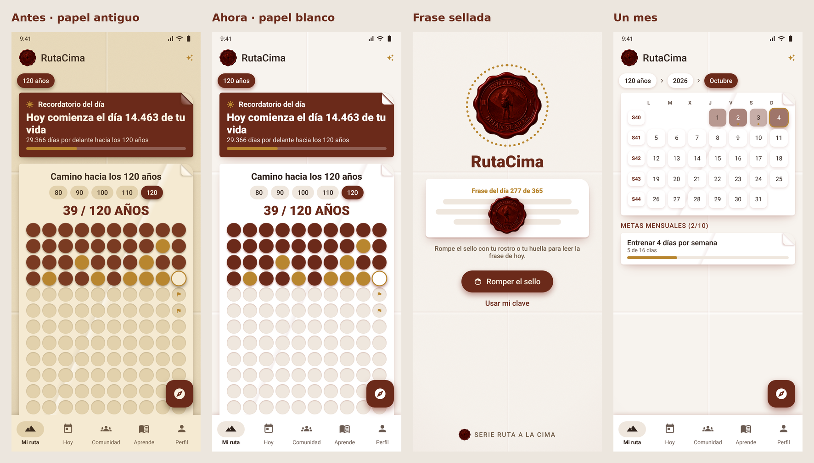
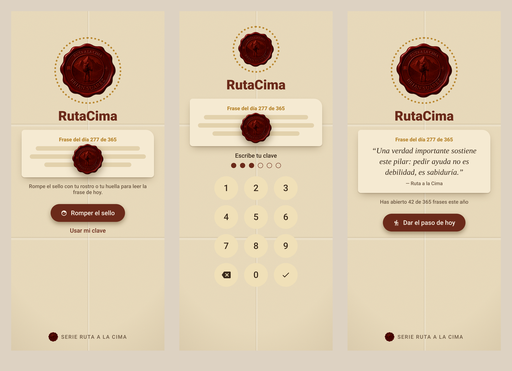

<p align="center">
  
</p>

<h1 align="center">RutaCima</h1>

<p align="center">
  <b>Tu vida hasta los 120 años, vista año por año y día por día.</b><br>
  La app del método <b>Ruta a la Cima</b>: 7 fases × 6 ejes para llegar a tu Cumbre Personal.
</p>

<p align="center">
  
  
  
  
  
</p>

> Serie Ruta a la Cima · © 2026 Brian Gonzalo Suárez Acevedo. Todos los derechos reservados.

---

## Contenido

1. [Qué es RutaCima](#qué-es-rutacima)
2. [El método en la app](#el-método-en-la-app)
3. [Recorrido por la app](#recorrido-por-la-app)
4. [RutaCima Web](#rutacima-web)
5. [Privacidad y seguridad](#privacidad-y-seguridad)
6. [Diseño](#diseño)
7. [Instalar y ejecutar](#instalar-y-ejecutar)
8. [Servidor, coach IA y web](#servidor-coach-ia-y-web)
9. [Cómo está hecha](#cómo-está-hecha)
10. [Contenido, pruebas y próximos pasos](#contenido-pruebas-y-próximos-pasos)

---

## Qué es RutaCima

RutaCima convierte el método **Ruta a la Cima** en una app para el día a día. Muestra tu vida como un camino
de puntos, **un punto por año hasta los 100 o 120**, y la baja en cascada a meses, semanas y días. Así ves
cómo lo que haces hoy suma a tu propósito de 5, 10, 15 o 20 años.

Incluye:

- un **planificador en cascada** con avance automático: propósito → año → mes → día;
- **18 hábitos diarios**, tres por cada eje;
- **24 guías** del método para completar en el teléfono, con resultados;
- un **coach con inteligencia artificial** que conoce tus metas y tu avance;
- **365 frases** de los libros, una por día, **selladas con cera** y que abres con tu rostro, tu huella o tu clave;
- una **comunidad** para compartir logros, evidencias y tu vision board;
- **RutaCima Web**, la misma app en el computador, con tu misma cuenta.

<p align="center">
  <br>
  <sub>Vistas previas del diseño (papel antiguo y papel blanco, frase sellada y un mes).</sub>
</p>

## El método en la app

**Tu Cumbre Personal** no es un punto geográfico ni una simple meta: es el estado en que todas tus dimensiones
convergen. Para llegar se atraviesan **7 fases** y se activan **6 ejes**.

| Las 7 fases del viaje | Los 6 ejes de tu cumbre |
|---|---|
| 1. Orientación | **Voluntad** · la llama que enciende tu camino |
| 2. Preparación | **Maestría** · la fortaleza que construyes con el tiempo |
| 3. Travesía | **Voz** · tu expresión auténtica en el mundo |
| 4. Ascenso | **Valor** · la capacidad de sostener tu vida con coherencia |
| 5. Culminación | **Evolución** · tu crecimiento constante |
| 6. Contemplación | **Trascendencia** · tu conexión con tu legado |
| 7. Descenso | |

**La cascada.** Cada propósito a largo plazo tiene metas anuales (los "campamentos base"), cada meta anual tiene
metas del mes, y cada meta del mes se marca día a día. El avance **sube solo**: los días cumplidos llenan la meta
del mes, las metas del mes llenan la del año, y las del año llenan el propósito. Si un nivel todavía no tiene
metas debajo, usas un avance manual.

## Recorrido por la app

### Primer uso: bienvenida y compromiso

La primera vez, la app te recibe como senderista y te pide:

- tu nombre;
- tu Cumbre Personal en una frase (puedes escribirla después);
- la fase en la que estás hoy.

Cierra con un **compromiso** de seis puntos: ser honesto contigo mismo, actuar con constancia, levantarte cada vez
que caigas, celebrar cada avance, revisar tu ruta cada 30 días y no rendirte cuando el camino se ponga difícil.

### Ventana de inicio y frase sellada

Cada vez que abres la app aparece el sello de cera con la **frase del día**: una de las **365 frases** tomadas
textualmente de los libros, una para cada día del año.

- Para leerla **rompes el sello**, según lo que elijas en Ajustes:
  - con tu **rostro o huella**: lo verifica el teléfono y la app nunca ve tu cara;
  - con una **clave numérica**;
  - con un **toque**.
- Tras 5 intentos fallidos de clave hay que esperar 30 segundos.
- Al abrirla, la frase te invita a **dar el paso de hoy**.
- Las frases que abriste se guardan en **Mis frases**. Las de días anteriores que no abriste quedan selladas.

<p align="center">
  
</p>

### Navegación

- **Barra inferior:** cinco secciones, **Mi ruta, Hoy, Comunidad, Aprende y Perfil**. Para ocupar poco espacio
  muestra solo íconos; al apoyar el dedo aparece el nombre, y si lo deslizas por la barra el nombre lo sigue.
  Al soltar se abre esa sección.
- **Barra superior:** el sello y el nombre de la pantalla donde estás.
- **Coach:** se abre desde el botón con destellos de la barra superior.

### Mi ruta

El centro de la app: **"Camino hacia los 100 años"**. La meta de vida la eliges entre 60 y 120 años.

- **Tu vida en puntos:**
  - un punto por año, diez por fila;
  - en burdeos lo vivido, en dorado el año actual y en blanco lo que falta;
  - una **bandera** marca los años con metas.
- **Cascada año → mes → semana → día:** tocas un año y bajas a sus meses; de ahí a las semanas y a cada día.
  Una miga de pan arriba te deja volver a cualquier nivel.
- **Botón flotante de saltos:** te lleva a hoy, esta semana, este mes o este año.
- **Recordatorio del día:**
  - qué día de tu vida es hoy;
  - cuántos días quedan hasta tu meta;
  - una frase distinta cada día.

  También puede llegar como **notificación diaria** a la hora que elijas.
- **Planificador** (se abre desde cada nivel), con seis pestañas:
  - **Cascada:** todo el árbol de metas con su avance;
  - **Día:** planificador diario con intención, prioridad #1, horario, pendientes, victorias, aprendizaje,
    gratitud, energía, agua y finanzas del día;
  - **Mes:** calendario del mes y balance mensual;
  - **Año:** metas anuales;
  - **Largo plazo:** propósitos a 5, 10, 15 o 20 años con su plan de acción;
  - **Balance:** balance anual.

### Hoy

Tu tablero del día:

- **Tu cumbre en una frase**, siempre a la vista.
- **Anillos de avance** de la cascada: propósito, año, mes y hoy.
- **Prioridad #1** del día.
- **Metas del mes**, para marcar con un toque que hoy diste el paso.
- **Checklist de 18 hábitos**, tres por eje. Por ejemplo: *"Hice algo hoy que me acerca a mi cumbre"*,
  *"Practiqué una habilidad clave"* o *"Ayudé a alguien sin esperar nada a cambio"*. Con 10 a 12 marcados vas
  en buen camino.
- **¿Día difícil?** Botones de rescate: *Me perdí*, *Tuve un mal día* y el *Kit de emergencia*.
- Accesos al **coach** y a **compartir tu avance** en la comunidad.

### Metas

**Nueva meta** abre un asistente de 4 pasos: **Nivel, Inspiración, Detalles y Plan**.

- **Nivel:** propósito a largo plazo, meta del año o meta del mes.
- **Inspiración:** se apoya en los bancos del método:
  - más de 80 metas para adaptar;
  - 150 indicadores por eje;
  - más de 200 acciones que activan varios ejes;
  - proyectos de confluencia.
- **Detalles y Plan:** cómo sabrás que la lograste y los pasos para llevarla a cabo.
- **Mejorar con IA** reescribe la meta en formato **ORSE**: Observable, Relevante, Específica y con Evidencia.

Cada meta anual lleva además:

- **prioridad ABCD:** máxima, importante, reactiva u observación;
- una **decisión:** continuar, acelerar, pausar o eliminar;
- un **estado:** no iniciada, iniciada, en pausa, en curso, avanzada o cumplida.

### Comunidad

Una bitácora para compartir el ascenso, con un formato propio (no es una copia de Instagram):

- **Cómo se ve cada publicación:** una postal horizontal 4:3 con la meta y el eje. Si no hay foto, se muestra la
  frase como cita destacada.
- **Cinco tipos:** logro, evidencia, visión (vision board), meta y reflexión.
- **Quién la ve:** pública, solo seguidores o solo yo.
- **Interacción:** **impulsos** (el voto de RutaCima), comentarios y seguir a otras personas.
- **Filtros del inicio:** *Para ti*, *Vision boards* y *Siguiendo*.
- **Dos formas de verla:** **Lista**, el muro hacia abajo, y **Cimas**, una publicación a pantalla completa que
  se pasa deslizando hacia arriba, con doble toque para impulsar y los botones al costado. La app recuerda cuál
  prefieres. Lo mismo en la web.
- **Sin cuenta**, la comunidad se muestra en modo demostración con publicaciones de ejemplo.

### Aprende: las 24 guías

Una biblioteca organizada por las etapas del ascenso. Cada guía se completa en la app y tus respuestas quedan
guardadas. Las evaluaciones **generan resultados**:

- total y porcentaje;
- interpretación;
- barras por grupo;
- foco sugerido;
- radar de ejes, que puedes guardar en **Mis ejes**.

| Etapa | Guías |
|---|---|
| **La ruta** | Descubre tu Cumbre Personal · Los 6 Ejes de tu Cumbre · El Viaje Transformativo · Diagnóstico Personal · Confluencia · Portales y Transiciones · Del Propósito al Valor · Campamento Base · Desde la Cima · Compañero de Ascenso · Guía de Caídas |
| **Herramientas** | Kit de Emergencia · Cuando te pierdes en la niebla · Cierre del Planificador 5 años |
| **Bonos** | Banco de Indicadores · Banco de Metas · Plantillas de Confluencia · Checklist de Cierre Mensual · Banco de Acciones Multi-Eje · Sistema Anti-Abandono · Kit de Evidencias |
| **Lecturas** | Ruta a la Cima (ebook) · Teoría del Viaje Transformativo |
| **Facilitadores** | Manual para Facilitadores |

### Coach IA

Un coach que responde con tu realidad, porque conoce:

- tu nombre y tu cumbre;
- tu fase;
- tus ejes;
- tus propósitos, metas del año y del mes, con su avance.

Sugerencias rápidas: *ayúdame a definir mi cumbre*, *divide mi meta anual en pasos*, *perdí la motivación*,
*planea mi semana*, *¿qué eje debo trabajar?* y *quiero crear un hábito*.

- **Con servidor**, usa inteligencia artificial con un límite diario por cuenta.
- **Sin conexión**, funciona en **modo guía**: responde con los protocolos y los bancos del método.

### Kit de emergencia

Herramientas que funcionan cuando las usas, no cuando las guardas:

- **Revisión mensual:** 15 minutos.
- **Plan semanal simplificado:** 10 minutos.
- **Preguntas de reorientación:** 3 minutos.
- **Checklist de cierre mensual.**
- **Tracker de 7 días.**
- **Matriz de decisiones**, que compara opciones con puntos.
- **Tarjetas de recordatorio**, una por eje. Por ejemplo: *"¿Esto me acerca o me aleja de mi cumbre?"*
- Los **8 protocolos** de *Cuando te pierdes en la niebla*.

### Perfil

- **Publicaciones:** tu diario de vida en fichas 4:5, a dos columnas.
- **Mi vida:** cada año, mes a mes, con lo que registraste. Puedes registrar un recuerdo o soñar un año futuro.
- **Vision board armado con IA:** con tu cumbre, tus propósitos, tus metas y tus ejes más débiles, la IA propone
  hasta 9 casillas. Cada una trae una frase en primera persona y qué foto tuya buscar o tomar. Tú las llenas con
  tus propias fotos (o buscas ideas en un banco de imágenes libres). Sin conexión, la app arma el tablero con las
  mismas reglas del método. Las fotos se guardan como publicaciones de visión privadas.
- **Ejes:** evaluación del 1 al 10, radar comparado e historial.
- **Mis frases:** las frases que ya abriste este año.

### Ajustes

- **Idioma:** 12 idiomas, que también se cambian desde los ajustes de idioma por app de Android 13+.
- **Estilo de papel:** *Papel blanco* (por defecto), *Papel antiguo* o *Pastel marrón*.
- **Cómo romper el sello de la frase:** rostro o huella, clave o toque.
- **Recordatorio diario** y su hora.
- **Mi perfil:** nombre, cumbre, fecha de nacimiento y meta de vida (60 a 120 años). La app muestra como
  referencia la esperanza de vida estimada de tu país.
- **Cuenta** para la comunidad, el coach y la web.
- **RutaCima Web.**

**Idiomas de la interfaz:** español, inglés, portugués, francés, alemán, italiano, chino, japonés, coreano, árabe,
hindi y ruso. El contenido de las guías está en español.

## RutaCima Web

**La misma app en el computador**, al estilo de WhatsApp Web, con tu misma cuenta y los mismos datos:

- Mi ruta (vida → año → mes → día);
- Hoy;
- Metas;
- Comunidad;
- Aprende (las 24 guías, con tus respuestas);
- Coach;
- Mis frases;
- Perfil (con el vision board).

Lo que cambias en un lado aparece en el otro.

**Cómo se vincula.** En el teléfono: **Perfil › ícono del computador › Escanear código**. Apuntas al código QR que
muestra la web o escribes sus 8 letras. El computador queda vinculado hasta que lo desvincules desde el teléfono
o cierres la sesión en la web.

<p align="center">
  <br><br>
  <br>
  <sub>RutaCima Web: vincular con código QR, y Mi ruta con tu vida en puntos.</sub>
</p>

**Cómo se mantiene al día:**

- **El teléfono** sincroniza al abrir la app, cada minuto mientras está abierta y 3 segundos después de cada cambio.
- **La web** recibe en vivo lo que llega del teléfono.
- **Si los dos cambian lo mismo a la vez**, se unen los días y hábitos marcados.

**Sin servidor configurado**, la web abre en **modo demostración** con una ruta de ejemplo.

## Privacidad y seguridad

- **Primero en tu teléfono.** Sin cuenta, todo se guarda solo en el teléfono y la app funciona completa.
- **La cuenta es opcional.** Solo hace falta para la comunidad real, el coach con IA y la web.
- **Tu ruta solo sube a tu cuenta mientras tengas un computador vinculado.** Desde la app puedes dejar de compartir
  y borrarla de la nube; en el teléfono queda completa.
- **El rostro y la huella** los verifica el sistema del teléfono; la app nunca los ve ni los guarda.
- **La clave numérica** se guarda cifrada con un hash (PBKDF2), nunca en texto.
- **En el servidor**, cada tabla tiene reglas de seguridad (RLS):
  - nadie ve la ruta de otra persona;
  - un navegador sin vincular no ve ni escribe nada;
  - las publicaciones "solo yo" las ve solo su autor.
- **La clave de la inteligencia artificial** vive en el servidor, nunca en la app.

## Diseño

- **Papel y pliegues.** La app simula una hoja de papel plegada: grano suave, dobleces, hojas con la esquina doblada
  y sombras en el burdeos del sello, nunca grises. Sigue Material Design 3 (`ui/theme/Papel.kt`).
- **Botones flotantes.** Los años, meses, semanas y días son botones que flotan y se hunden al tocarlos.
- **Logo.** El **sello de cera de Ruta a la Cima**, original del autor. Aparece en el ícono, el arranque, la ventana
  de inicio, la barra superior y la web.
- **Archivos.** Los archivos en alta resolución y las vistas previas están en [`diseno/`](diseno).

<p align="center">
  
  
</p>

**Diseño con IA.** El proyecto incluye la skill [impeccable](https://github.com/pbakaus/impeccable) (Apache 2.0) en
`.claude/skills/impeccable`. Con Claude Code puedes usar, por ejemplo, `/impeccable critique perfil`.

## Instalar y ejecutar

**Requisitos:**

- Android Studio Ladybug (2024.2) o más reciente, que ya incluye JDK 17+.
- Android SDK 35.
- Un teléfono o emulador con Android 8.0 (API 26) o superior.

**Pasos:**

1. En Android Studio, **File › Open** y elige la carpeta del proyecto.
2. Espera la sincronización de Gradle. La primera vez descarga Gradle y las dependencias.
3. Elige un emulador o conecta tu teléfono con depuración USB, y pulsa **Run ▶**.

Para actualizar después: **Git › Pull** y **Run ▶**.

Sin configurar nada, la app funciona completa en el teléfono. La comunidad se muestra en modo demostración y el
coach en modo guía.

## Servidor, coach IA y web

RutaCima usa [Supabase](https://supabase.com) para las cuentas, la comunidad, el coach y la web.

1. **Base de datos.** Crea un proyecto y, en **SQL Editor**, ejecuta completo [`supabase/schema.sql`](supabase/schema.sql).
   Crea:
   - perfiles, publicaciones, impulsos, comentarios y seguidores;
   - el uso del coach;
   - la ruta compartida y los computadores vinculados;
   - las reglas de seguridad y el bucket `media` para las fotos.
2. **Web.** En **Authentication › Sign In / Providers**, activa **Allow anonymous sign-ins**. La web entra como
   invitada hasta que la vinculas.
3. **Coach.** La clave de la inteligencia artificial queda en el servidor:
   ```bash
   supabase functions deploy coach
   supabase secrets set ANTHROPIC_API_KEY=sk-ant-...
   # opcionales
   supabase secrets set COACH_MODEL=claude-sonnet-5-5 COACH_DAILY_LIMIT=30
   ```
4. **App.** En `local.properties` (no se sube a GitHub):
   ```properties
   supabase.url=https://TU-PROYECTO.supabase.co
   supabase.anonKey=TU_ANON_KEY
   # opcional: dónde está publicada la web
   rutacima.webUrl=https://passbri.github.io/rutacima/web/
   ```
5. **Web.** Pon la misma URL y la misma clave en [`web/config.js`](web/config.js). La clave *anon* es pública por
   diseño; la seguridad la ponen las reglas del paso 1.
6. **Publicar la web.** Activa **GitHub Pages** (Settings › Pages › rama `main`); la web queda en
   `https://passbri.github.io/rutacima/web/`.
7. **Probar.** Vuelve a compilar la app y crea tu cuenta en **Perfil › Ajustes**. La comunidad pasa a ser real y ya
   puedes vincular la web.

## Cómo está hecha

| Parte | Tecnología |
|---|---|
| App Android | Kotlin 2.0 · Jetpack Compose · Material 3 · Navigation |
| Datos en el teléfono | Room (SQLite), con migraciones para no perder datos al actualizar |
| Recordatorios | WorkManager |
| Seguridad | BiometricPrompt (rostro, huella o bloqueo del teléfono) · PBKDF2 |
| Código QR | Escáner de Google Play Services (sin permiso de cámara para la app) |
| Servidor | Supabase: Auth, PostgreSQL con RLS, Storage, Realtime y Edge Functions (Deno) |
| Coach | Función `coach` en Supabase con la API de Claude |
| Web | HTML, CSS y JavaScript sin compilación · supabase-js |

```
app/src/main/
├── assets/content/          ← las 24 guías en JSON (generadas desde los .docx)
├── assets/bancos/           ← bancos de metas, indicadores, acciones y proyectos
├── assets/frases/           ← las 365 frases del día en 12 idiomas
├── java/com/rutaalacima/app/
│   ├── domain/model/        ← reglas del método: ejes, fases, vida, frases, prioridad, kit, sincronización
│   ├── data/content/        ← lectura de las guías y cálculo de resultados
│   ├── data/local/          ← Room: perfil, respuestas, ejes, checklist, planificador, publicaciones, coach
│   ├── data/Cascada.kt      ← avance automático día → mes → año → propósito
│   ├── data/remote/         ← cliente de Supabase
│   ├── data/social/         ← comunidad (con modo demostración)
│   ├── data/coach/          ← coach IA y modo guía
│   ├── data/frases/         ← frase del día y frases abiertas
│   ├── data/web/            ← RutaCima Web: vincular un computador y sincronizar
│   ├── seguridad/           ← sello: rostro, huella o clave
│   ├── notificaciones/      ← recordatorio diario
│   └── ui/                  ← pantallas en Compose (ruta, hoy, metas, comunidad, aprende, perfil, web…)
└── res/values*/strings.xml  ← textos en 12 idiomas
supabase/                    ← schema.sql y la función "coach"
web/                         ← RutaCima Web: index.html, app.js, estilos.css y config.js
diseno/                      ← logo, vistas previas y las 365 frases
tools/                       ← conversores de los Word a JSON
```

## Contenido, pruebas y próximos pasos

**Actualizar las guías desde los Word:**

```bash
pip install python-docx
python3 tools/convert.py <carpeta_con_los_docx> app/src/main/assets/content
python3 tools/bancos.py
```

**Cómo lee los Word el conversor:**

- Detecta como campo para escribir todo lo que va seguido de "Escriba aquí", una caja vacía o una línea `____`.
- Toma los `/10` y `(1-10)` como escalas, que dan resultados.
- Toma los `☐ Sí ☐ No` como opciones.

**Pruebas:** `./gradlew test` comprueba:

- las 24 guías y sus IDs;
- el cálculo de resultados de las evaluaciones;
- el calendario de vida;
- las 365 frases;
- el vision board;
- la sincronización con la web;
- las reglas del método.

**Próximos pasos:**

- RutaCima Web en los 12 idiomas (hoy está en español).
- Traducción del contenido de las guías.
- Exportar a PDF y copia de seguridad.
- Modo facilitador para grupos.
- Dominio propio: rutacima.app.

---

<p align="center">
  <br>
  <b>Serie Ruta a la Cima</b> · Creada por Brian Gonzalo Suárez Acevedo<br>
  <sub>© 2026 Brian Gonzalo Suárez Acevedo. Todos los derechos reservados.</sub>
</p>
